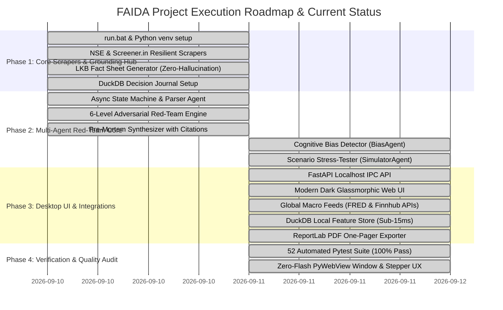

# 03. Decision Framework & Project Roadmap: FAIDA

## 1. Confirmed Decisions Log (All 11 Decisions Locked)

All strategic and tactical decisions for **FAIDA** have been finalized:

| # | Architecture Dimension | Selected Decision | Strategic Implementation Details |
| :---: | :--- | :--- | :--- |
| **1** | **Project Identity** | **FAIDA** (*Financial Adversarial Indian Data Agents*) | Memorable acronym playing on the Hindi word *फ़ायदा* ("profit/benefit"), contrasting with its adversarial red-teaming nature. |
| **2** | **Desktop Runtime** | **PyWebView + FastAPI (Localhost)** | Zero Node.js / Rust build complexity for the end-user; native OS window with dark-mode web UI; lightweight (< 120MB RAM). |
| **3** | **LLM Engine** | **Hybrid Local-First** | Out-of-the-box local inference via Ollama (**`gemma4:e4b`** as primary local, fallback `qwen3.5:4b`), with an optional UI settings toggle to connect high-speed cloud APIs (**Groq API** e.g. `llama-3.3-70b-versatile`, or Google Gemini 2.5 Flash). |
| **4** | **Agent Orchestration** | **Custom Lightweight Async State Machine** | Sub-400 token micro-prompts per turn. Eliminates heavy prompt templates from frameworks like CrewAI, preventing context saturation and drift on 3B–4B models. |
| **5** | **Tone & Persona** | **6-Level Continuum Slider** | Allows the user to calibrate the interaction from `Level 1: 100% Socratic Educator` (beginner analogies) to `Level 6: 100% Technical Finance / Quant Forensic` (zero fluff, pure balance-sheet metrics). |
| **6** | **Grounding & Explainability**| **Local Knowledge Base (LKB)** | Raw scraped market data is deterministically parsed into an LKB fact sheet before prompting. The LLM is strictly constrained to cite facts using `[LKB-XX]` tags. The UI renders these as clickable verification badges. |
| **7** | **Packaging & Setup** | **Single-Click `run.bat` Launcher** | Automatically detects Python 3.11, creates `.venv`, installs `requirements.txt`, checks Ollama connectivity, and boots the native desktop window. |
| **8** | **Decision Persistence** | **Local DuckDB Journal (`faida_journal.duckdb`)** | Automatically records each user thesis, target price, date, LKB snapshot, and the Adversarial Pre-Mortem report so users can track how warnings materialized over time. |
| **9** | **Scraping Cadence** | **Strictly On-Demand with 15-min Cache** | Scrapers trigger on user query; zero background CPU/network churn; fast local cache check prevents redundant external hits. |
| **10** | **Regulatory Framing** | **Permanent SEBI Educational Disclaimer** | A permanent, elegant UI footer banner clarifies that FAIDA is an educational pre-mortem/risk-awareness tool and does not provide SEBI-registered financial advisory services. |
| **11** | **Phase 1 Asset Scope** | **NSE & BSE Equities (Large, Mid, Small)** | Master equity technicals, Screener.in balance sheet forensics, and corporate red-teaming first; G-Secs, Bonds, and MCX commodities follow in Phase 2. |

---

## 2. Micro-Implementation Readiness Checklist

With all high-level and architectural decisions locked, only **3 operational defaults** need to be standardized during the initial code setup (we have already selected the best-practice defaults for you):

1. **Database File Location**:
   * Stored in the application root as `./data/faida_journal.duckdb` (automatically created and excluded from git if sensitive).
2. **Default Ollama Model String**:
   * Configured by default to `qwen3.5:4b` (verified as installed on your system), with automatic fallback to any available local model (`gemma4:e4b`, `qwen2.5:7b`) if requested.
3. **Default Port for Local FastAPI IPC**:
   * Binds to `127.0.0.1:8765` (isolated to localhost; port auto-increments if occupied).

**Conclusion: There are zero blocking decisions left. The project is ready for immediate Phase 1 implementation.**

---

## 3. Project Directory Layout (Current Active Implementation)

```
Adverserial Financial Agents/
│
├── run.bat                          # One-click Windows launcher (venv, uv, app boot)
├── requirements.txt                 # Pinned dependencies (FastAPI, DuckDB, ReportLab, etc.)
├── main.py                          # PyWebView zero-flash desktop entry point & healthcheck
├── pytest.ini                       # Test configuration
│
├── backend/
│   ├── app.py                       # FastAPI ASGI application & REST endpoints
│   ├── config.py                    # Environment settings, Ollama & Cloud toggles
│   │
│   ├── scrapers/                    # Resilient market scrapers & global APIs
│   │   ├── nse_client.py            # NSE live quotes & delivery % with curl_cffi TLS impersonation
│   │   ├── screener_client.py       # Screener.in 10-year fundamental ratios & 3Y CFO/PAT accrual forensics
│   │   ├── yfinance_client.py       # Historical OHLCV, 20/50/200 EMAs, RSI(14)
│   │   ├── bse_client.py            # BSE corporate announcements & governance risk flags
│   │   ├── macro_client.py          # India VIX volatility regime & 10Y sovereign yield baseline
│   │   ├── fred_client.py           # FRED API: Brent Crude, US 10Y Yield, and DXY Dollar Index
│   │   ├── finnhub_client.py        # Finnhub API: Real-time ADR news & global market sentiment
│   │   └── broker_client.py         # Pluggable read-only broker gateway adapter
│   │
│   ├── lkb/                         # Grounding Engine (Local Knowledge Base)
│   │   ├── models.py                # Pydantic schemas for LKB facts, citations, and pre-mortem models
│   │   └── builder.py               # Deterministic compiler assembling multi-source LKB packets
│   │
│   ├── agents/                      # Lightweight Async State Machine Swarm
│   │   ├── parser_agent.py          # User investment hypothesis entity extractor & intent resolver
│   │   ├── debater_agent.py         # 6-level Red-Team Devil's Advocate with zero-hallucination constraints
│   │   ├── educator_agent.py        # Pre-Mortem synthesis, AFS scoring & pedagogical takeaways
│   │   ├── bias_agent.py            # Cognitive bias detector (Anchoring, Sunk Cost, FOMO, etc.)
│   │   ├── simulator_agent.py       # Stress-test simulator (Crude surge, RBI rate hike, INR drop, margin drop)
│   │   └── orchestrator.py          # Swarm orchestrator coordinating the 5-stage pipeline
│   │
│   ├── llm/                         # Inference Gateway
│   │   ├── provider.py              # Multi-tier gateway: Local Ollama, Groq dynamic cascade & clean fallback
│   │   └── ollama_client.py         # Local Ollama HTTP client (localhost:11434)
│   │
│   ├── db/                          # Persistence & Caching
│   │   ├── journal.py               # DuckDB thesis, pre-mortem audit log & decision history
│   │   └── feature_store.py         # DuckDB TTL-governed market feature cache (sub-15ms access)
│   │
│   └── export/                      # Institutional Reporting
│       └── pdf_generator.py         # Institutional Pre-Mortem One-Pager PDF generator with citations
│
├── frontend/                        # Native PyWebView UI (Dark Glassmorphic Theme)
│   ├── index.html                   # Desktop application single-page shell
│   ├── css/
│   │   └── styles.css               # Modern dark-mode styling with CSS variables & micro-animations
│   └── js/
│       └── app.js                   # Application state, telemetry stepper, API bridges & PDF triggers
│
└── tests/                           # Automated Test Suite (52/52 Passing)
    ├── test_api.py                  # API endpoints, input validation, and security tests
    ├── test_bias.py                 # Cognitive bias detection test suite
    ├── test_feature_store.py        # DuckDB cache, TTL expiration, and persistence tests
    ├── test_journal.py              # Decision journal read/write tests
    ├── test_lkb.py                  # LKB grounding packet compilation tests
    ├── test_macro.py                # India VIX, FRED macro, and broker client tests
    ├── test_parser.py               # Natural language hypothesis parsing tests
    ├── test_pdf.py                  # PDF export and XML escaping tests
    ├── test_scrapers.py             # Scraper resilience, Finnhub, and BSE tests
    └── test_simulator.py            # Scenario stress-tester simulation tests
```

---

## 4. Completed Implementation Milestones



